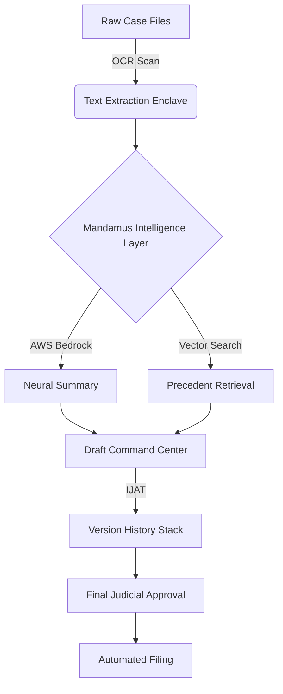

# ⚖️ MANDAMUS: THE JUDICIAL INTELLIGENCE ENCLAVE

  
   
  <h3><b>"Justice Delayed is Justice Denied."</b></h3>
  
<i>The next-generation command center for a modern, AI-accelerated judiciary.</i>

  
  
  
  

---

## 🚩 THE CRISIS: JUDICIAL STAGNATION

The Indian legal system is currently facing an unprecedented "Processing Debt." The numbers are staggering:

*   🔴 **5.1 CRORE+** cases are currently pending in Indian courts.
*   🔴 **1,80,000+** cases have been stagnant for **over 30 years**.
*   🔴 **2% GDP LOSS** annually due to judicial friction and case backlogs.
*   🔴 **500+ PAGES** of manual reading required per case file before a single hearing.

---

## ⚡ THE SOLUTION: MANDAMUS

**Mandamus** isn't just an app; it's a **Forensic Intelligence Layer** that sits between a judge and a mountain of data. We don't replace the judge; we give them **Exoskeletal Intelligence** to process cases at 10x speed with 100% security.

### 🏛️ CORE INTELLIGENCE MODULES

#### 01. NEURAL SUMMARISER (AES-256 SECURE)
> *Process 500 pages in 60 seconds.*  
Transforms massive FIRs, charge sheets, and witness statements into a high-fidelity **1-page intelligence brief**.
*   **Tech**: AWS Bedrock (Nova Pro) + OCR Pipeline.
*   **Output**: Facts, Flagged Statutes, and Evidence Metadata.

#### 02. RAG-DRIVEN PRECEDENT FINDER
> *Lakhs of judgments. 15 seconds search.*  
Semantic vector search that finds contextually similar cases (Supreme/High Court) with **Similarity Matching Scores**.
*   **Tech**: Vector Embeddings + RAG (Retrieval Augmented Generation).

#### 03. DRAFT COMMAND CENTER (VERSION HISTORY)
> *Structured drafting with a safety net.*  
Generates legally sound petitions and judgments while tracking every edit with an **Immutable Judicial Audit Trail (IJAT)**.
*   **Feature**: Word-level **Visual Diff Viewer** (Red/Green) for forensic tracking of changes.

#### 04. SMART SCHEDULER & VIRTUAL ENCLAVE
> *Eliminate unnecessary adjournments.*  
Predicts case readiness and hosts secure, real-time WebRTC hearings with **Integrated Socket.io Signaling**.

---

## 🛠️ THE ARCHITECTURE

---

## 🏗️ TECH STACK ("THE SHIT WE USED")

| Layer | Technology |
| :--- | :--- |
| **Generative AI** | **AWS Bedrock (Amazon Nova Pro v1:0)** |
| **Backend API** | **FastAPI (Python 3.11)** |
| **Frontend UI** | **React 18 + Vite (Neo-Brutalist Styling)** |
| **Real-time** | **Socket.io (Signaling Engine)** |
| **Persistence** | **Firebase / Firestore / S3** |
| **Communication** | **WebRTC (Virtual Courtroom Enclave)** |

---

## 🚀 DEPLOYMENT & SETUP

### Backend (Render/Railway)
1. Set up `.env` with `AWS_ACCESS_KEY_ID`, `AWS_SECRET_ACCESS_KEY`, and `AWS_REGION`.
2. Run: `pip install -r requirements.txt && uvicorn main:app --host 0.0.0.0 --port 8000`

### Frontend (Vercel)
1. Set `VITE_API_URL` to your backend URL.
2. Run: `npm install && npm run dev`

---

  
Built with ❤️ by the Mandamus Team for the future of Justice.

  <b>"Accelerating Justice. Ensuring Integrity."</b>

