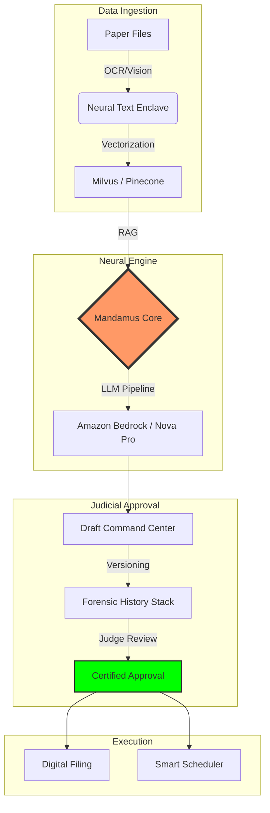

# ⚖️ MANDAMUS: THE OPERATING SYSTEM FOR MODERN JUSTICE

<div align="center">
  
  <br/>
  <h2><b>ACCELERATING THE SCALES OF JUSTICE</b></h2>
  <p><i>A High-Fidelity Neural Intelligence Platform for Judicial Excellence & Case Lifecycle Management.</i></p>

  [](https://github.com/chv-sneha/Mandamus)
  [](https://github.com/chv-sneha/Mandamus)
  [](https://github.com/chv-sneha/Mandamus)
</div>

---

## 🏛️ EXECUTIVE SUMMARY

**Mandamus** is a sovereign-grade Judicial Intelligence Platform engineered to resolve the global crisis of judicial backlogs. By integrating state-of-the-art **Retrieval Augmented Generation (RAG)**, **Generative AI**, and **Immutable Audit Trails**, Mandamus empowers judicial officers to process complex case files at 10x speed while maintaining 100% decision-making integrity.

> *"Justice delayed is justice denied."* Mandamus ensures that technology serves the law, reducing the 5.1 Crore case backlog through intelligent automation, not human replacement.

---

## 🚩 THE SYSTEMIC CHALLENGE

The modern judiciary is drowning in "Information Debt." The current process is manual, fragmented, and vulnerable to human fatigue:

*   📑 **Volume Complexity**: Average case files exceed **500+ pages** of unsearchable scans.
*   📉 **Economic Friction**: Judicial delays cost the Indian economy **~2% of GDP** annually.
*   ⏳ **Temporal Stagnation**: Over **1,80,000 cases** have been pending for **30+ years**.
*   🧠 **Cognitive Load**: Judges must cross-reference lakhs of precedents manually across disjointed databases.

---

## ⚡ THE MANDAMUS SOLUTION

Mandamus transforms the judicial workflow from a linear, manual process into a **Neural Intelligence Command Center**.

### 🔍 01. Neural Case Summarization
The engine utilizes **AWS Bedrock (Amazon Nova Pro)** to ingest massive FIRs, charge sheets, and witness statements. It produces a high-fidelity intelligence brief in under 60 seconds.
*   **Deep Extraction**: Identifies parties, timelines, and statutory violations automatically.
*   **Statutory Mapping**: Cross-references claims against IPC, CrPC, and local laws.

### ⚖️ 02. RAG-Powered Precedent Intelligence
Our proprietary RAG pipeline performs semantic searches across a unified vector database of Indian judgments.
*   **Semantic Scoring**: Beyond keyword matching, the system understands legal intent.
*   **Contextual Relevance**: Ranks cases based on factual similarity and judicial hierarchy.

### 📝 03. Forensic Drafting Enclave
A sophisticated command center for generating structured legal drafts (Petitions, Written Arguments, Judgments).
*   **Immutable Judicial Audit Trail (IJAT)**: Tracks every word added or removed by the judge or the AI.
*   **Visual Diff Viewer**: Word-level forensic comparison of document versions with green/red highlights.

### 📅 04. Predictive Scheduler & Virtual Hearing
An intelligent scheduler that analyzes case readiness and party availability to eliminate unnecessary adjournments.
*   **Signaling Server**: Integrated Socket.io engine for low-latency, secure virtual courtrooms.
*   **WebRTC Enclave**: Secure video conferencing for remote testimony.

---

## 🏗️ SYSTEM ARCHITECTURE



---

## 🛡️ SECURITY & GOVERNANCE

*   **AES-256 Encryption**: All data is encrypted at rest and in transit.
*   **Judge-in-the-Loop (JITL)**: The system is designed to *assist*, not *decide*. No action is taken without explicit judicial approval.
*   **Private Enclaves**: Case data is processed in isolated compute environments to ensure complete confidentiality.
*   **Auditability**: Every AI suggestion is logged with a confidence score and a source citation.

---

## 🛠️ THE TECHNOLOGY STACK

Mandamus is built on a resilient, enterprise-grade stack:

*   **Intelligence Layer**: AWS Bedrock (Amazon Nova Pro v1:0)
*   **Backend Orchestration**: FastAPI (Python 3.11)
*   **Frontend Command Center**: React 18 (Vite) + Neo-Brutalist UI
*   **Real-time Communication**: Socket.io (ASGI Signaling)
*   **Identity & Persistence**: Firebase / Firestore
*   **Streaming & Video**: WebRTC Enclave

---

## 🗺️ STRATEGIC ROADMAP

- [ ] **Phase 1**: High-fidelity summarization and RAG-based precedent search. (COMPLETED)
- [ ] **Phase 2**: Multi-lingual support (Vernacular Judgment Processing).
- [ ] **Phase 3**: Blockchain-based Immutable Case Record storage.
- [ ] **Phase 4**: Cross-jurisdictional legal logic mapping (International Law).

---

## 🚀 GETTING STARTED

### Installation
```bash
# Clone the Repository
git clone https://github.com/chv-sneha/Mandamus.git

# Frontend Setup
cd Mandamus
npm install
npm run dev

# Backend Setup
cd backend
pip install -r requirements.txt
uvicorn main:app --reload
```

---

<div align="center">
  <p><b>Accelerating Justice. Ensuring Integrity. Building the future of Law.</b></p>
  <p>Built for the Modern Judiciary.</p>
</div>
