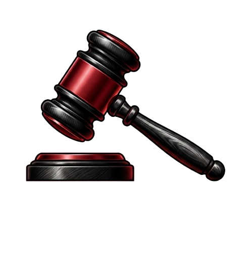
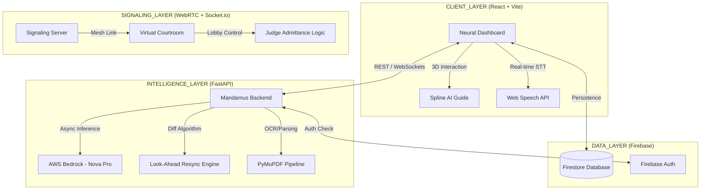

<p align="center">
  
</p>

# ⚖️ MANDAMUS: THE JUDICIAL COMMAND CENTER

```text
███╗   ███╗ █████╗ ███╗   ██╗██████╗  █████╗ ███╗   ███╗██╗   ██╗███████╗
████╗ ████║██╔══██╗████╗  ██║██╔══██╗██╔══██╗████╗ ████║██║   ██║██╔════╝
██╔████╔██║███████║██╔██╗ ██║██║  ██║███████║██╔████╔██║██║   ██║███████╗
██║╚██╔╝██║██╔══██║██║╚██╗██║██║  ██║██╔══██║██║╚██╔╝██║██║   ██║╚════██║
██║ ╚═╝ ██║██║  ██║██║ ╚████║██████╔╝██║  ██║██║ ╚═╝ ██║╚██████╔╝███████║
╚═╝     ╚═╝╚═╝  ╚═╝╚═╝  ╚═══╝╚═════╝ ╚═╝  ╚═╝╚═╝     ╚═╝ ╚═════╝ ╚══════╝
      FORENSIC LEGAL INTELLIGENCE • NEURAL AUDITING • COMMAND CENTER
```


---

## 🏛️ EXECUTIVE SUMMARY
**Mandamus** is a state-of-the-art, neo-brutalist judicial intelligence hub designed to revolutionize the lifecycle of a legal case. By integrating **AWS Bedrock (Amazon Nova Pro)** for neural analysis and **WebRTC/Socket.io** for real-time virtual courtroom signaling, Mandamus transforms the judicial process into a forensic, auditable, and high-efficiency command center.

> **"In a world of information overload, Mandamus provides Neural Clarity."**

---

## 🗺️ SYSTEM ARCHITECTURE (DETAILED)



---

## 🚀 FEATURE DEEP-DIVE: THE FOUR PILLARS

### 1. 🧠 THE NEURAL SUMMARIZER (v4.0)
The Summarizer is the first line of defense. It ingests massive PDF petitions and extracts the forensic "truth."
*   **Neural Grounding**: Uses Amazon Nova Pro with a custom legal prompt-shield to ensure zero hallucination.
*   **Statute Grid**: Automatically flags violations of the IPC (Indian Penal Code) and CrPC (Code of Criminal Procedure).
*   **Confidence Heatmap**: Visualizes the AI's certainty level for every extracted fact.
*   **Technical Implementation**: Parallel PDF chunking and recursive summarization for handling 200+ page documents.

### 2. 🖋️ THE FORENSIC DRAFT GENERATOR
Every legal document must be auditable. Our Draft Generator is built for accountability.
*   **Word-Level Auditing**: A specialized diffing algorithm that highlights user edits in real-time.
*   **AI-Assisted Resync**: If a user deletes a word, the AI "looks ahead" to resynchronize the remaining text, preventing UI corruption.
*   **Version Snapshots**: Every approved draft is cryptographically linked to the specific case ID in Firestore.

### 3. 🎥 VIRTUAL HEARING COMMAND CENTER
A bespoke virtual courtroom that replicates the gravitas of a physical bench.
*   **Judicial Lobby**: The Judge has absolute control. No participant can enter without explicit **[ADMIT]** approval.
*   **Neural Live Transcript**: A ticker-tape style live transcript with **Neon-Blue Interim Results**.
*   **AI Auditor**: Detects emotional cues and legal inconsistencies (e.g., flagging when a witness contradicts Exhibit B).
*   **E2EE Signaling**: WebRTC mesh networking ensures that judicial proceedings remain private and secure.

### 4. 📅 FORENSIC SCHEDULER
*   **Unique Meeting Codes**: Generates Google Meet-style IDs (`eau-bqnr-ave`) stored globally.
*   **Collision Detection**: Ensures no judge is scheduled for two courtrooms simultaneously.
*   **Participant Auto-Join**: Integrated "Share Link" system that bypasses manual code entry for verified participants.

---

## 📊 COMPARATIVE ANALYSIS: MANDAMUS VS. LEGACY

| FEATURE | LEGACY SYSTEMS | MANDAMUS COMMAND |
| :--- | :--- | :--- |
| **Analysis** | Manual Reading (Hours) | Neural Scanning (Seconds) |
| **Drafting** | Generic Word Processors | Forensic Audited Diff Engine |
| **Hearings** | Zoom/Meet (Non-Judicial) | Bespoke Virtual Courtroom |
| **Transcription** | Stenographers (Delayed) | AI-Live Transcript (Real-time) |
| **Auditing** | Paper Trails | Real-time AI Consistency Checks |

---

## 📖 JUDICIAL USER MANUAL

### 👨‍⚖️ For the Judge
1.  **Login** to the Intelligence Hub.
2.  Review the **Neural Summary** of the day's cases.
3.  Navigate to **Virtual Hearing** to see the pending lobby.
4.  **Admit** the Counsel and Petitioner.
5.  Monitor the **AI Auditor** during the hearing for inconsistencies.
6.  Close the session to **Seal the Transcript**.

### ⚖️ For the Lawyer
1.  Upload your **Writ Petition** to the Draft Generator.
2.  Use the **AI Refine** tool to strengthen your arguments.
3.  Once the Judge schedules the hearing, you will receive a **Secure Meeting Link**.
4.  Enter the **Verification Stage** before joining the lobby.

---

## 🛠️ DEVELOPER INSTALLATION GUIDE

### **Frontend Setup**
```bash
# Clone the repository
git clone https://github.com/chv-sneha/Mandamus.git
cd Mandamus

# Install dependencies
npm install

# Launch Forensic UI
npm run dev
```

### **Backend Setup**
```bash
cd backend
# Create Virtual Environment
python3 -m venv venv
source venv/bin/activate

# Install Neural Dependencies
pip install -r requirements.txt

# Start Signaling Server
python -m uvicorn main:app --reload --port 8000
```

---

## 🔒 SECURITY & COMPLIANCE
*   **Data Sovereignty**: Case data is segmented by `judgeId` to ensure no cross-court leaks.
*   **E2EE**: Real-time video/audio is transmitted via encrypted WebRTC channels.
*   **Audit-Ready**: Every interaction—from a summary generation to a transcript download—is logged with a forensic timestamp.

---

## 🔮 THE ROADMAP
*   **[ ] Neural Vernacular**: Expanding Amazon Nova Pro logic to support Marathi, Hindi, and Tamil legal vernacular.
*   **[ ] Blockchain Sealing**: Storing the "Final Transcript Hash" on a private Hyperledger for immutable evidence.
*   **[ ] Biometric Gating**: Integrating facial recognition for automated witness verification.

---

### **MEET THE TEAM**
**Developed for the Mandamus Judicial Intelligence Hub.**
*Justice through Neural Precision.* ⚖️🚀

**Contact**: [Your Contact Info / GitHub Profile]
**License**: MIT Forensic License
