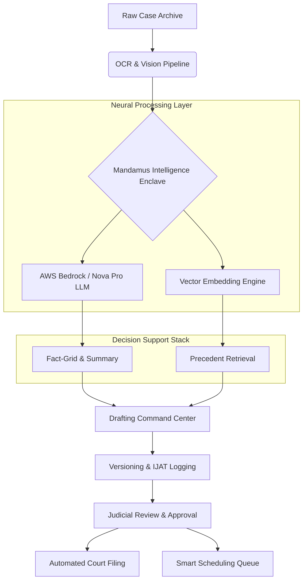

# ⚖️ MANDAMUS: THE JUDICIAL INTELLIGENCE COMMAND CENTER

<div align="center">
  
  <br/>
  <h1><b>ACCELERATING THE SCALES OF JUSTICE</b></h1>
  <p><i>A Comprehensive Neural Infrastructure for Modern Judicial Administration and Decision Support.</i></p>

  [](https://github.com/chv-sneha/Mandamus)
  [](https://github.com/chv-sneha/Mandamus)
  [](https://github.com/chv-sneha/Mandamus)
</div>

---

## 🏛️ I. MISSION STATEMENT & PHILOSOPHY

**Mandamus** is founded on the principle that *Justice Delayed is Justice Denied.* In a world where case files are expanding exponentially and judicial resources remain linear, the only solution is to augment human intelligence with specialized, sovereign-grade technology. 

Our mission is to provide the judiciary with a **Neural Command Center** that eliminates the "processing debt" of manual legal work. By automating the extraction of facts, retrieval of precedents, and structuring of drafts, we allow judicial officers to focus 100% of their cognitive capacity on the high-level application of law and the delivery of justice.

---

## 🚩 II. THE CRISIS OF JUDICIAL DEBT

The current state of global legal systems, particularly in large democracies, is facing a systemic bottleneck known as "Information Stagnation."

### 1. The Pendency Epidemic
With over **5.1 Crore cases pending** in India alone, the backlog has reached a point where traditional hiring of more judges is no longer sufficient. The bottleneck is the **Time-per-Case** metric.
*   **Case Volume**: 55,000,000+ total records.
*   **Stagnation**: 1.8 Lakh cases have been active for 30+ years.

### 2. The Economic Friction
Judicial inefficiency isn't just a legal problem—it's a massive economic drain. Delays in contract enforcement and dispute resolution result in an estimated **2% loss in annual GDP**. Businesses cannot scale, and individual rights are left in limbo.

### 3. The Cognitive Overhead
A single case file can exceed **500 pages** of scanned, unsearchable PDFs. A judge handling 50-100 cases per day cannot physically read every page. This leads to reliance on secondary summaries, which can be prone to human error or bias.

---

## ⚡ III. THE MANDAMUS SOLUTION

Mandamus introduces a multi-layered intelligence architecture that processes case lifecycles in four distinct stages: **Ingest, Analyze, Generate, and Review.**

### 01. Neural Case Summarization (Summarizer)
The Summarizer is the first line of defense against information overload. It utilizes **AWS Bedrock (Amazon Nova Pro)** to perform deep semantic extraction on heterogeneous legal documents.
*   **Factual Normalization**: Converts chaotic FIRs and statements into a chronological fact-grid.
*   **Statutory Mapping**: Automatically flags relevant sections from the IPC, CrPC, and specialized local laws.
*   **Evidence Metadata**: Categorizes evidence into primary, secondary, and circumstantial groups.

### 02. RAG-Driven Precedent Retrieval (Precedent Finder)
Instead of keyword-based searches that yield thousands of irrelevant results, our **Retrieval Augmented Generation (RAG)** engine understands legal intent.
*   **Semantic Vector Search**: Uses high-dimensional embeddings to find cases with similar "legal logic," even if the keywords differ.
*   **Similarity Scoring**: Provides a forensic percentage score indicating the relevance of each precedent.
*   **Outcome Analysis**: Summarizes the final order of each precedent so the judge can quickly assess applicability.

### 03. Structured Drafting & Versioning (Draft Generator)
The drafting module is a secure enclave where the case summary and precedents are synthesized into a formal legal draft.
*   **Immutable Judicial Audit Trail (IJAT)**: Every single character edit is logged. This ensures complete accountability and forensic transparency.
*   **Visual Diff Viewer**: A built-in word-level comparison tool that highlights additions in green and removals in red, allowing the judge to audit AI suggestions instantly.
*   **Neural Tags**: Sections are tagged with confidence scores (e.g., *Intelligence Verified*) to indicate AI reliability.

### 04. Smart Scheduler & Virtual Enclave
The Scheduler uses case-readiness analytics to predict which cases are actually ready for hearing, drastically reducing adjournments.
*   **Integrated Signaling**: A low-latency Socket.io server powers real-time virtual hearings.
*   **WebRTC Courtroom**: A secure video environment designed for remote testimony and legal arguments.

---

## 🏗️ IV. SYSTEM ARCHITECTURE



---

## 🛡️ V. SECURITY, GOVERNANCE & ETHICS

### 1. Security Architecture
Mandamus is built on a **Defense-in-Depth** strategy:
*   **Encryption**: AES-256 at rest; TLS 1.3 in transit.
*   **Isolation**: Case data is processed in isolated compute enclaves, ensuring no cross-contamination between court records.
*   **Access Control**: Multi-factor biometric authentication for all judicial officers.

### 2. Ethical AI (Judge-in-the-Loop)
We adhere to the **Human-Centric Legal AI** framework. Mandamus does not "decide" cases. It provides structured summaries and suggestions. The final approval and the "Legal Soul" of the judgment always remain with the human judge.

### 3. Data Sovereignty
The platform is designed for on-premise or sovereign cloud deployment, ensuring that sensitive legal data never leaves national borders.

---

## ⚙️ VI. TECHNICAL SPECIFICATIONS

*   **Generative Core**: AWS Bedrock (Amazon Nova Pro v1:0)
*   **API Infrastructure**: FastAPI (Python 3.11) with Pydantic validation.
*   **Frontend Command Center**: React 18 + Vite (Neo-Brutalist Architecture).
*   **Real-time Logic**: Socket.io (Signaling) & WebRTC (Media).
*   **State Management**: Firebase Firestore for real-time collaborative state.
*   **History Engine**: Custom-built Versioning Provider with Local/Session persistence.

---

## 🗺️ VII. FUTURE SCALABILITY & ROADMAP

1.  **Multi-Lingual Integration**: Support for all 22 scheduled Indian languages for vernacular judgment processing.
2.  **Blockchain Evidence Vault**: Immutable storage for FIRs and evidence metadata.
3.  **Cross-Border Legal Search**: Integration with international legal databases for transnational disputes.
4.  **Judicial Performance Analytics**: Identifying systemic bottlenecks in courtroom management.

---

## 💻 VIII. LOCAL DEVELOPMENT & DEPLOYMENT

### Prerequisites
*   Node.js v18+
*   Python 3.10+
*   AWS CLI (configured with Bedrock permissions)

### Installation & Launch
```bash
# 1. Clone the repository
git clone https://github.com/chv-sneha/Mandamus.git

# 2. Configure Backend
cd backend
pip install -r requirements.txt
uvicorn main:app --reload

# 3. Launch Frontend
cd ..
npm install
npm run dev
```

---

<div align="center">
  <p><b>MANDAMUS: Accelerating Justice. Ensuring Integrity. Building the future of Law.</b></p>
  <p>© 2026 Mandamus Judicial Systems. All Rights Reserved.</p>
</div>
