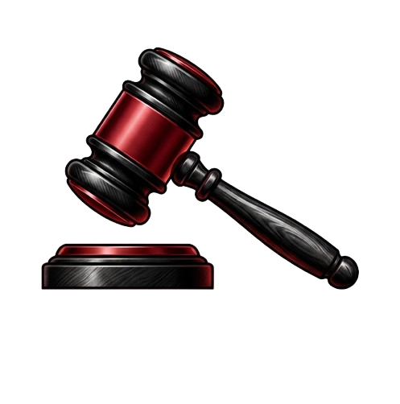
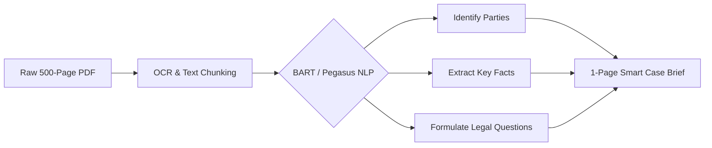
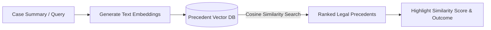
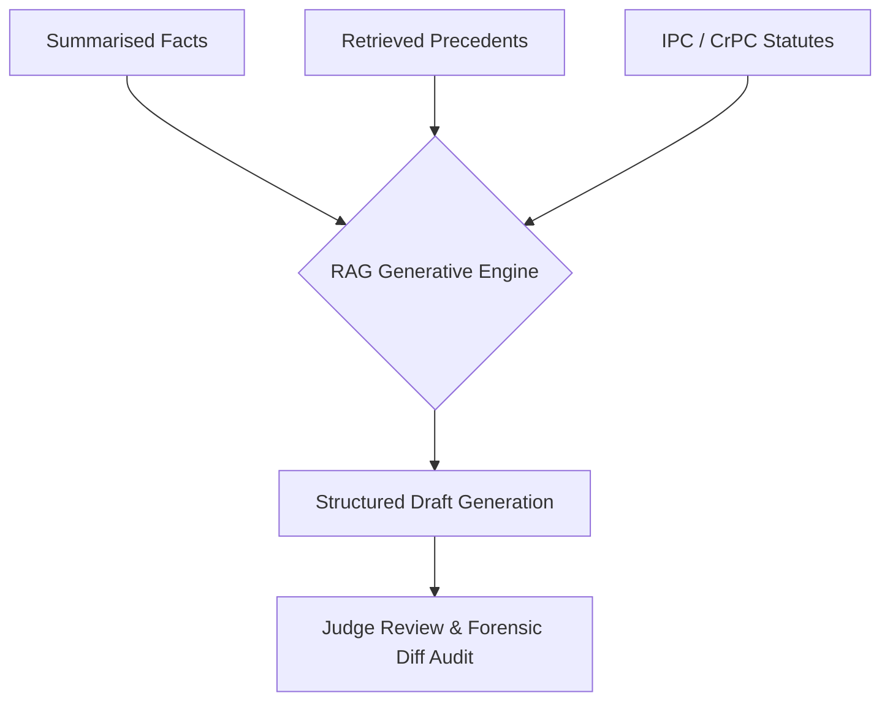
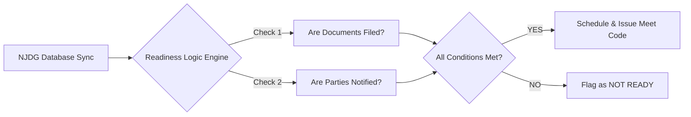
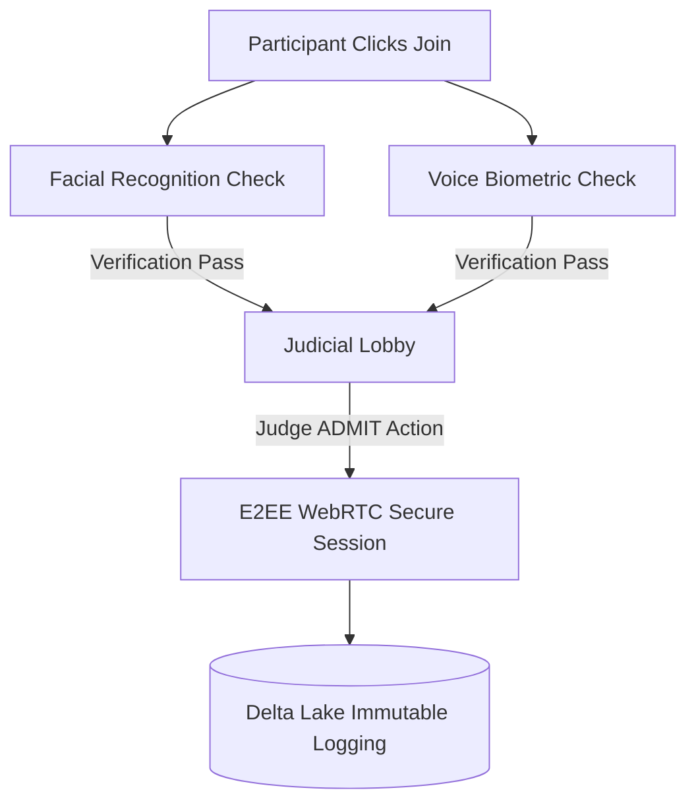
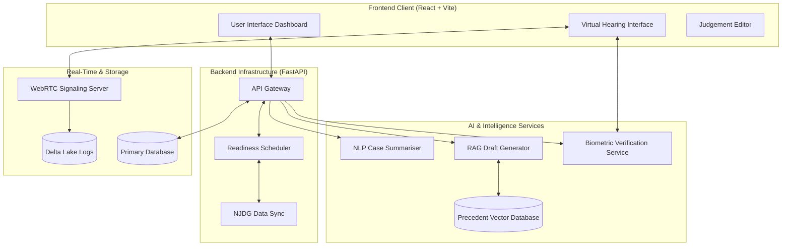
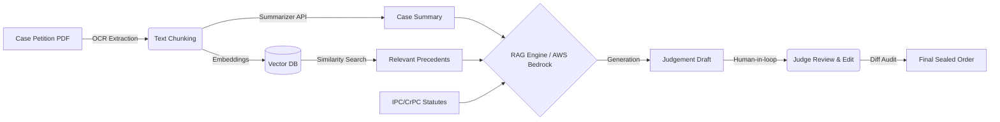
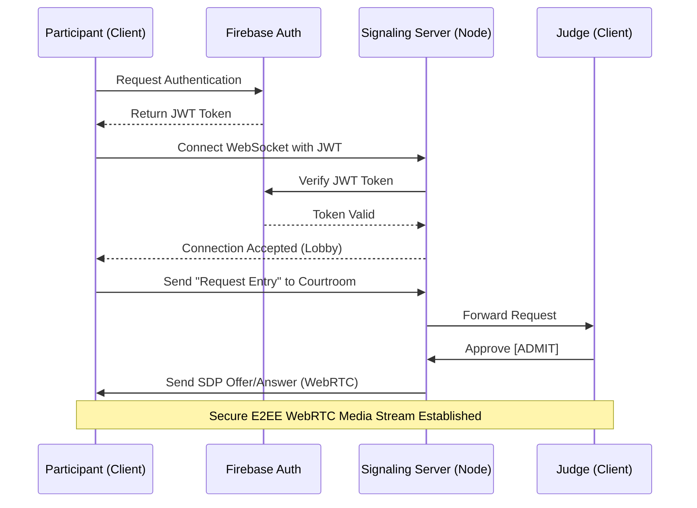
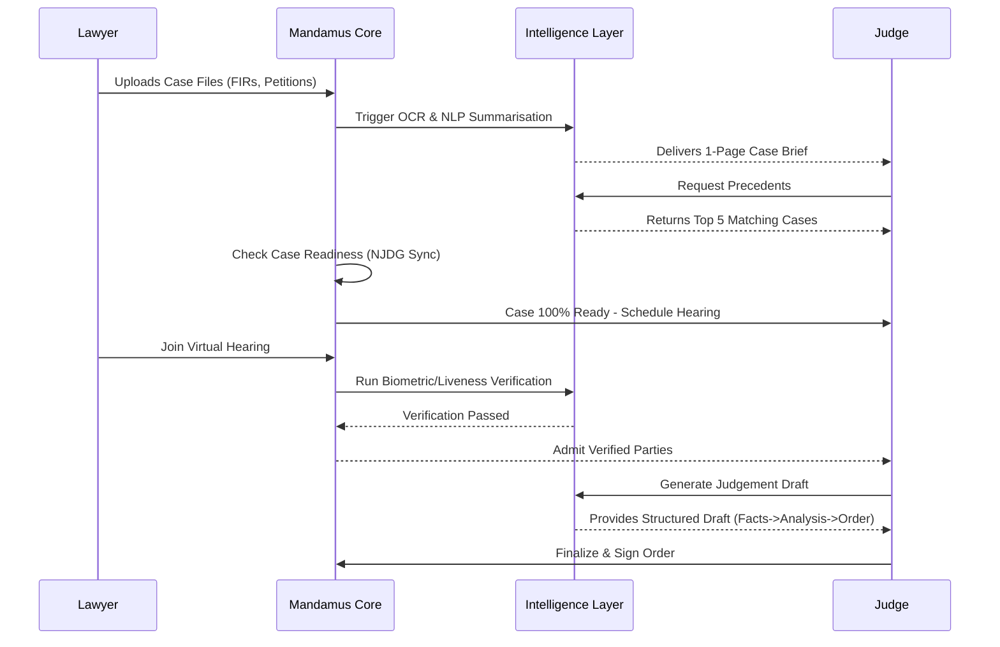

<p align="center">
  
</p>

```text
            ███╗   ███╗ █████╗ ███╗   ██╗██████╗  █████╗ ███╗   ███╗██╗   ██╗███████╗
            ████╗ ████║██╔══██╗████╗  ██║██╔══██╗██╔══██╗████╗ ████║██║   ██║██╔════╝
            ██╔████╔██║███████║██╔██╗ ██║██║  ██║███████║██╔████╔██║██║   ██║███████╗
            ██║╚██╔╝██║██╔══██║██║╚██╗██║██║  ██║██╔══██║██║╚██╔╝██║██║   ██║╚════██║
            ██║ ╚═╝ ██║██║  ██║██║ ╚████║██████╔╝██║  ██║██║ ╚═╝ ██║╚██████╔╝███████║
            ╚═╝     ╚═╝╚═╝  ╚═╝╚═╝  ╚═══╝╚═════╝ ╚═╝  ╚═╝╚═╝     ╚═╝ ╚═════╝ ╚══════╝
                FORENSIC LEGAL INTELLIGENCE • NEURAL AUDITING • COMMAND CENTER
```

# ⚖️ MANDAMUS: The Judicial Intelligence Platform

Welcome to **Mandamus**, an advanced, AI-driven judicial platform designed to streamline court proceedings, reduce case pendency, and empower judges and lawyers with state-of-the-art technological tools. Built to handle the massive complexity of legal workflows, Mandamus integrates machine learning, secure real-time communication, and data-driven scheduling into a single unified platform.

---

## 🏛️ The Crisis: Judicial Overload & Pendency

Before Mandamus, the legal system has been buckling under its own weight. 

**The Staggering Statistics:**
* Currently, there are over **55 Million pending cases** in the Indian judiciary system alone.
* Over **70% of prisoners** are undertrials, awaiting their day in court while evidence degrades.
* On average, a standard civil or criminal case can take anywhere from **5 to 15 years** to reach a final resolution.

**A Real-World Example:**
Consider a standard property dispute. The initial FIR and witness statements run up to 200 pages. The judge must spend weeks manually reading the raw, unstructured documents. When the first hearing is finally scheduled, it is abruptly adjourned because the defense failed to file a crucial reply—a fact no one noticed until the day of the hearing. Six months later, during trial, lawyers and clerks spend hours manually hunting through physical books and legacy portals for past precedents. Finally, drafting the 50-page judgement takes the judge another two months of manual synthesis.

This analog, fragmented workflow is unsustainable. **That is why we built Mandamus.**

---

## 🚀 The Five Core Systems

Mandamus is built upon five foundational pillars, each addressing a critical bottleneck in the traditional judicial system.

### 1. 🧠 Smart Case Summariser
**The Problem:** Judges and lawyers spend countless hours reading hundreds of pages of charge sheets, FIRs, and witness statements.

**The Theory & Implementation:**
In traditional legal environments, processing unstructured data is inherently prone to human error and fatigue. The Smart Case Summariser solves this by employing a sophisticated OCR pipeline combined with state-of-the-art Natural Language Processing (NLP) models like BART or Pegasus. Instead of merely extracting text, the AI performs *abstractive summarization*—understanding the semantic context of the legal document. It cross-references statements, isolates the fundamental arguments, and identifies the core legal questions at play. This ensures that a judge doesn't just get a shortened version of the document, but a highly synthesized, chronologically accurate narrative of the case facts.

**Key Outcomes:** 
* Ingests 500+ pages of complex legal documents effortlessly.
* Condenses the entire docket into a clean, 1-page structured brief in under 60 seconds.
* Automatically highlights involved parties, key facts, and critical legal questions.


```mermaid
flowchart LR
    A[Raw 500-Page PDF] --> B[OCR & Text Chunking]
    B --> C{BART / Pegasus NLP}
    C --> D[Identify Parties]
    C --> E[Extract Key Facts]
    C --> F[Formulate Legal Questions]
    D --> G[1-Page Smart Case Brief]
    E --> G
    F --> G
```

### 2. 🔍 Intelligent Precedent Finder
**The Problem:** Finding relevant past judgements across lakhs of cases is tedious and prone to missing crucial precedents due to rigid keyword-matching.

**The Theory & Implementation:**
The judicial system operates heavily on *stare decisis* (the doctrine of precedent). However, standard search engines are brittle; if a lawyer searches for "vehicular homicide," they might miss cases tagged as "culpable homicide by rash driving." Mandamus utilizes Sentence Transformers to generate high-dimensional vector embeddings of case summaries and legal queries. By mapping these embeddings into a Vector Database, the system performs Cosine Similarity Search. This means the engine understands the *meaning* and *context* of a case, returning highly relevant precedents even if the exact keywords do not match. It fundamentally shifts legal research from keyword-matching to semantic intelligence.

**Key Outcomes:**
* Scans through lakhs of judgements to surface the top 5 most relevant past cases in seconds.
* Provides high-accuracy similarity scores and outcome metrics (e.g., Convicted/Acquitted).
* Allows natural language queries.


```mermaid
flowchart LR
    A[Case Summary / Query] --> B[Generate Text Embeddings]
    B --> C[(Precedent Vector DB)]
    C -->|Cosine Similarity Search| D[Ranked Legal Precedents]
    D --> E[Highlight Similarity Score & Outcome]
```

### 3. 🖋️ Judgement Draft Generator
**The Problem:** Drafting judgements requires synthesizing facts, arguments, precedents, and statutes manually, leading to massive delays and backlogs.

**The Theory & Implementation:**
Drafting a judgement is an exercise in immense cognitive load, requiring the judge to weave together raw facts, adversarial arguments, statutory law, and binding precedents into a legally sound order. The Draft Generator operates on a robust Retrieval-Augmented Generation (RAG) architecture. When a judge initiates a draft, the system retrieves the case facts from the Summariser, pulls the relevant statutes (IPC/CrPC), and fetches the binding precedents from the Vector DB. These inputs are fed as context into a Large Language Model (such as Amazon Nova Pro) with strict grounding prompts to prevent hallucination. The output is a highly structured draft that logically progresses from facts to the final order. Crucially, the system includes a forensic diffing audit trail, ensuring every word modified by the AI or the human judge is tracked and transparent.

**Key Outcomes:**
* Automatically generates a legally sound, structured draft (Facts &rarr; Arguments &rarr; Legal Analysis &rarr; Order).
* Reduces drafting time by up to 80%.
* Keeps the human strictly in the loop with a transparent edit history and approval system.


```mermaid
flowchart TD
    A[Summarised Facts] --> D{RAG Generative Engine}
    B[Retrieved Precedents] --> D
    C[IPC / CrPC Statutes] --> D
    D --> E[Structured Draft Generation]
    E --> F[Judge Review & Forensic Diff Audit]
```

### 4. 📅 Smart Hearing Scheduler
**The Problem:** Unnecessary adjournments happen because cases are scheduled before documents are fully filed or parties are notified.

**The Theory & Implementation:**
Court adjournments are the primary driver of judicial pendency. A massive percentage of hearings are adjourned simply because procedural prerequisites—like filing a reply or serving notice to respondents—have not been met. The Smart Scheduler acts as an algorithmic gatekeeper. By integrating directly with the National Judicial Data Grid (NJDG) or equivalent e-Courts APIs, the system continuously monitors the metadata of a case. It runs a deterministic readiness logic engine that checks for document completeness, party notifications, and advocate availability. If a case is flagged as "Not Ready," it physically cannot be placed on the judge's docket. When it is ready, the system employs collision detection to guarantee no scheduling overlaps, issuing secure access codes automatically.

**Key Outcomes:**
* Eliminates scheduling conflicts.
* Only schedules hearings when a case is 100% ready.
* Automatically syncs and alerts stakeholders.


```mermaid
flowchart LR
    A[NJDG Database Sync] --> B{Readiness Logic Engine}
    B -->|Check 1| C[Are Documents Filed?]
    B -->|Check 2| D[Are Parties Notified?]
    C --> E{All Conditions Met?}
    D --> E
    E -->|YES| F[Schedule & Issue Meet Code]
    E -->|NO| G[Flag as NOT READY]
```

### 5. 🎥 Secure Virtual Hearing & Biometric Verification
**The Problem:** Virtual hearings are prone to unauthorized access, spoofing, and lack the gravitas of a physical courtroom.

**The Theory & Implementation:**
Since the advent of virtual courts, identity spoofing, unauthorized access, and a lack of decorum have plagued digital hearings. Standard video conferencing tools were built for corporate meetings, not judicial proceedings where perjury and impersonation carry severe legal consequences. The Mandamus Virtual Hearing Command Center is a bespoke WebRTC environment engineered specifically for the judiciary. Before any participant can enter the lobby, they must pass a multi-modal biometric check: facial recognition to verify identity against government IDs, and voice biometrics to ensure the speaker is authentic. Liveness detection algorithms run concurrently to prevent deepfakes or photo-spoofing. Furthermore, the judge holds absolute cryptographic control over the session state; no one enters the encrypted peer-to-peer courtroom without an explicit `[ADMIT]` action, and all proceedings are logged to an immutable Delta Lake to ensure absolute forensic integrity.

**Key Outcomes:**
* Peer-to-peer WebRTC connection ensures low latency and high security.
* Biometric gates stop unauthorized entities at the lobby.
* Deepfake and spoofing prevention mechanisms built-in.


```mermaid
flowchart TD
    A[Participant Clicks Join] --> B[Facial Recognition Check]
    A --> C[Voice Biometric Check]
    B -->|Verification Pass| D[Judicial Lobby]
    C -->|Verification Pass| D
    D -->|Judge ADMIT Action| E[E2EE WebRTC Secure Session]
    E --> F[(Delta Lake Immutable Logging)]
```

---

## 🗺️ System Architecture

The following diagram illustrates how the frontend, intelligence layer, and real-time signaling components interact within the overarching Mandamus ecosystem.


```mermaid
graph TD
    subgraph "Frontend Client (React + Vite)"
        UI[User Interface Dashboard]
        VH_Client[Virtual Hearing Interface]
        Draft_Editor[Judgement Editor]
    end

    subgraph "AI & Intelligence Services"
        Summariser[NLP Case Summariser]
        RAG[RAG Draft Generator]
        VectorDB[(Precedent Vector Database)]
        Bio[Biometric Verification Service]
    end

    subgraph "Backend Infrastructure (FastAPI)"
        API[API Gateway]
        Scheduler[Readiness Scheduler]
        NJDG[NJDG Data Sync]
    end

    subgraph "Real-Time & Storage"
        Signaling[WebRTC Signaling Server]
        Delta[(Delta Lake Logs)]
        PrimaryDB[(Primary Database)]
    end

    UI <--> API
    API --> Summariser
    API --> RAG
    RAG <--> VectorDB
    API --> Bio

    VH_Client <--> Signaling
    VH_Client <--> Bio
    
    API <--> Scheduler
    Scheduler <--> NJDG
    
    API <--> PrimaryDB
    Signaling --> Delta
```

---

## 🧠 AI Workflows & Security Diagrams

### RAG-Powered Judgement Generation Process
This diagram maps out how Mandamus automatically constructs a forensic judgement draft using vector search and generative AI.


```mermaid
graph LR
    A[Case Petition PDF] -->|OCR Extraction| B(Text Chunking)
    B -->|Summarizer API| C[Case Summary]
    B -->|Embeddings| D[(Vector DB)]
    D -->|Similarity Search| E[Relevant Precedents]
    
    C --> F{RAG Engine / AWS Bedrock}
    E --> F
    G[IPC/CrPC Statutes] --> F
    
    F -->|Generation| H[Judgement Draft]
    H -->|Human-in-loop| I(Judge Review & Edit)
    I -->|Diff Audit| J[Final Sealed Order]
```

### E2EE Virtual Hearing Security Flow
WebRTC is utilized to establish a completely peer-to-peer, encrypted connection, mitigating any man-in-the-middle attacks, while the Node.js signaling server handles lobby mechanics.


```mermaid
sequenceDiagram
    participant P as Participant (Client)
    participant Auth as Firebase Auth
    participant SS as Signaling Server (Node)
    participant J as Judge (Client)

    P->>Auth: Request Authentication
    Auth-->>P: Return JWT Token
    P->>SS: Connect WebSocket with JWT
    SS->>Auth: Verify JWT Token
    Auth-->>SS: Token Valid
    SS-->>P: Connection Accepted (Lobby)
    P->>SS: Send "Request Entry" to Courtroom
    SS->>J: Forward Request
    J->>SS: Approve [ADMIT]
    SS->>P: Send SDP Offer/Answer (WebRTC)
    Note over P,J: Secure E2EE WebRTC Media Stream Established
```

---

## 📁 Repository Folder Structure

The project is structured as a monorepo consisting of a React Vite frontend and a Python/Node backend. Below is the detailed directory map:

```text
Mandamus/
├── backend/                       # Python FastAPI Backend & Signaling Server
│   ├── main.py                    # Core FastAPI server (AI logic, inference, NJDG sync)
│   ├── requirements.txt           # Python dependencies (FastAPI, PyMuPDF, etc.)
│   ├── precedents_db.json         # Mock DB storing precedent documents
│   └── signaling/                 # WebRTC/Socket.io signaling server (Node.js)
│       ├── server.js              # Socket events for virtual courtroom and chat
│       └── package.json           # Signaling server dependencies
│
├── src/                           # React Frontend Application
│   ├── components/                # Modular UI Components
│   │   ├── virtual_hearing/       # Virtual courtroom components (Video Grid, WebRTC)
│   │   ├── Summarizer.jsx         # Case summarisation logic and UI
│   │   ├── PrecedentFinder.jsx    # Precedent search UI and semantic highlighting
│   │   ├── DraftGenerator.jsx     # Auditable text editor for judgement drafting
│   │   ├── Scheduler.jsx          # NJDG-synced smart calendar interface
│   │   ├── LegalChat.jsx          # Context-aware chat sidebar
│   │   └── MandamusGuide.jsx      # Spline 3D intelligent guide integration
│   │
│   ├── context/                   # React Contexts (Global State)
│   │   ├── AuthContext.jsx        # Firebase Authentication state
│   │   ├── MandamusContext.jsx    # Global dashboard and UI state
│   │   └── HistoryContext.jsx     # Interaction logging and auditing
│   │
│   ├── lib/                       # Utilities and External Configs
│   │   ├── firebase.js            # Firebase SDK initialization
│   │   └── firestoreHelpers.js    # DB interaction helpers
│   │
│   ├── pages/                     # Full-Page Routing Views
│   │   ├── AboutPage.jsx          
│   │   └── HowItWorksPage.jsx
│   │
│   └── utils/                     # Helper functions
│       └── diff.js                # Custom word-level text diffing algorithm
│
├── public/                        # Static Assets (Logo, Images, models)
├── index.html                     # Main application entry point
├── package.json                   # NPM dependencies (React, Firebase, WebRTC)
└── vite.config.js                 # Vite bundler configuration
```

---

## 🛠️ Data Flow & Execution Workflow

How a case progresses through the Mandamus platform sequentially:


```mermaid
sequenceDiagram
    participant Lawyer
    participant Platform as Mandamus Core
    participant AI as Intelligence Layer
    participant Judge
    
    Lawyer->>Platform: Uploads Case Files (FIRs, Petitions)
    Platform->>AI: Trigger OCR & NLP Summarisation
    AI-->>Judge: Delivers 1-Page Case Brief
    
    Judge->>AI: Request Precedents
    AI-->>Judge: Returns Top 5 Matching Cases
    
    Platform->>Platform: Check Case Readiness (NJDG Sync)
    Platform->>Judge: Case 100% Ready - Schedule Hearing
    
    Lawyer->>Platform: Join Virtual Hearing
    Platform->>AI: Run Biometric/Liveness Verification
    AI-->>Platform: Verification Passed
    Platform-->>Judge: Admit Verified Parties
    
    Judge->>AI: Generate Judgement Draft
    AI-->>Judge: Provides Structured Draft (Facts->Analysis->Order)
    Judge->>Platform: Finalize & Sign Order
```

---

## ⚙️ Technical Stack

**Frontend:**
* React.js (Vite)
* Tailwind CSS / Custom CSS Modules
* WebRTC for Virtual Hearings

**Backend & AI:**
* FastAPI (Python)
* Sentence Transformers (Semantic Search)
* Amazon Nova Pro / Pegasus (Text Summarization & RAG)
* Socket.io (Signaling & Real-time chat)

**Database & Security:**
* Firebase / Firestore for document and user storage
* Delta Lake for Immutable Logging
* AES-256 Encrypted WebRTC Channels

---

## 💻 Developer Installation Guide

### Prerequisites
* Node.js (v18+)
* Python (3.9+)
* Git

### Frontend Setup
```bash
# Clone the repository
git clone https://github.com/chv-sneha/Mandamus.git
cd Mandamus

# Install dependencies
npm install

# Start the development server
npm run dev
```

### Backend Setup
```bash
# Navigate to the backend directory
cd backend

# Create and activate a virtual environment
python -m venv venv
source venv/bin/activate  # On Windows use: venv\Scripts\activate

# Install required packages
pip install -r requirements.txt

# Start the FastAPI server
uvicorn main:app --reload --port 8000
```

### Signaling Server Setup
```bash
# Navigate to the signaling directory
cd backend/signaling

# Install dependencies
npm install

# Start the signaling server
node server.js
```

---

## 🛡️ Security & Compliance

* **Data Sovereignty:** All sensitive case data and personally identifiable information (PII) are stored with strict access controls.
* **Biometric Guardrails:** Virtual hearings cannot be accessed without successful facial and voice validation, ensuring absolute identity certainty.
* **Immutable Records:** Actions taken within the platform, including hearing logs and generated drafts, are securely audited to prevent tampering.

---

## 🤝 Contributing

We welcome contributions to make Mandamus even better. Please follow standard pull request procedures, ensuring that any new AI integrations or backend modifications are thoroughly documented and tested.

## 📄 License

This project is licensed under the MIT License.
